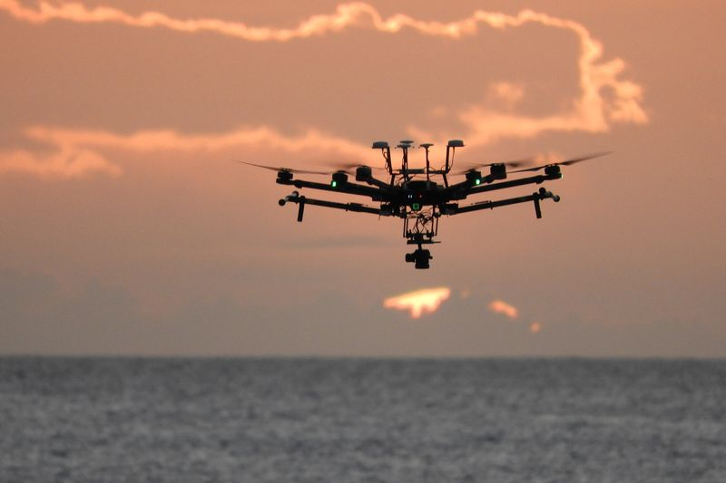

```{r setup, include=FALSE}
knitr::opts_chunk$set(echo = FALSE)
```




# Vocabulary

| Words from the text     | Synonym / explanation in English                              |
| ----------------------- | ------------------------------------------------------------- |
| A large stretch         | A large zone                                                  |
| Uncrewed aerial vehicle | A drone                                                       |
| In the shallow waters   | In the low depth waters                                       |
| Coral bleaching events  | Periods during which corals become white (*explanation below) |
| To launch drones        | To take off drones                                            |
| Beneath the waves       | Under the waves                                               |
| Short hops              | Short distances                                               |
| From the shore          | From the coast                                                |
| Ruggedness              | Robustness                                                    |
| Staring                 | Watching                                                      |

*Explanation for "coral bleaching events" : with rising temperature, corals expel the important algae that give their colour and their essential nutrients.

# Analysis table

| Researchers                  | Romina King, an environmental geographer at the University of Guam in Mangilao (one of the project’s principal investigators).  Ved Chirayath, director of the NASA Ames Laboratory for Advanced Sensing in Mountain View. |
| ---------------------------- | -------------------------------------------------------------------------------------------------------------------------------------------------------------------------------------------------------------------------- |
| Published in ?               | 25 JUNE 2019                                                                                                                                                                                                               |
| General topic?               | This article deals with drones which are use to make a cartography of the coral reef.                                                                                                                                      |
| Procedure/what was examined? |  These drones are a new engineer invention. They are able to take perfectly clear shots through the water.                                                                                                                 |
| Conclusions/discovery?       | These shots allow to have a 3D map of the coral reef. This will allow to the scientists to track their responses to the climate change.                                                                                    |
| Remaining questions?         | Could the drones help us in other works like for example to feel a population of trees in a parcel of a forest?                                                                                                            |

# Link

<https://www.nature.com/articles/d41586-019-01988-9>
