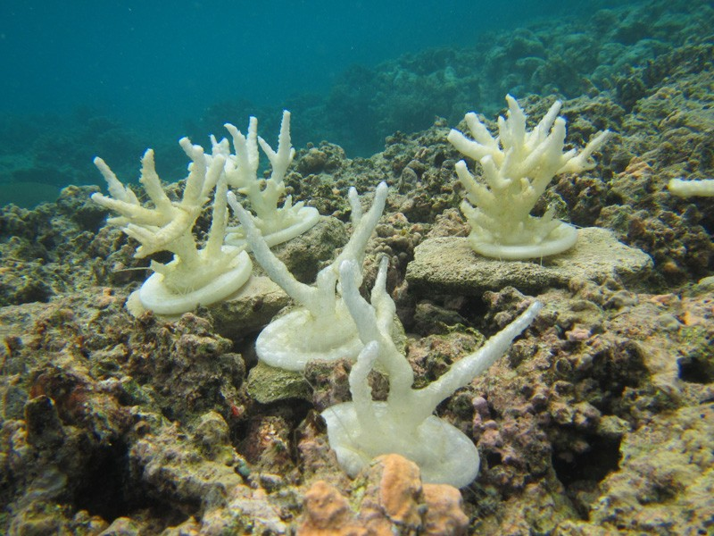
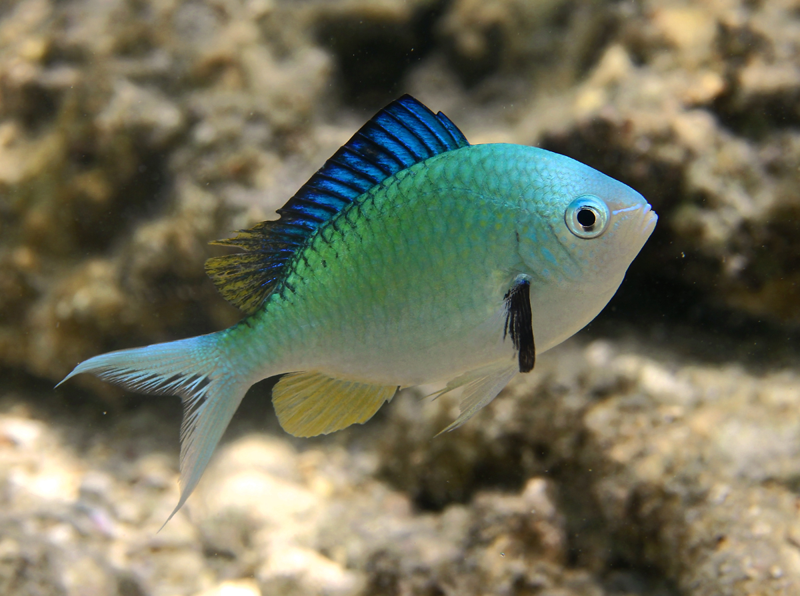
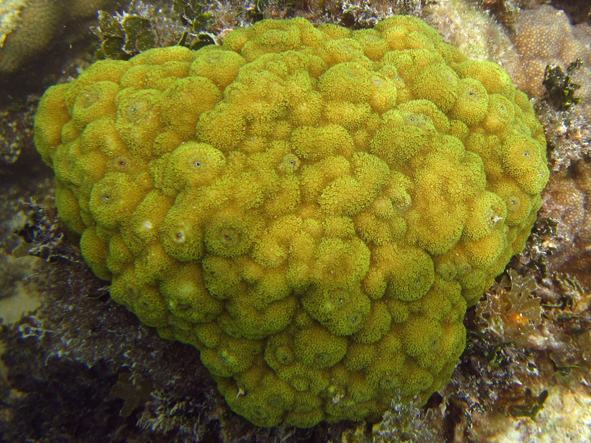
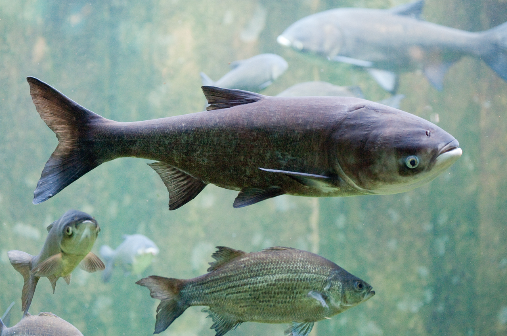

```{r setup, include=FALSE}
knitr::opts_chunk$set(echo = TRUE)
```



# Vocabulary

| Words from the text                 | Synonym /   explanation in English                                                                          |
| ----------------------------------- | ----------------------------------------------------------------------------------------------------------- |
| In their wake                       | In their way                                                                                                |
| A shelter                           | A refuge, a safe house                                                                                      |
| To withstand                        | To resist                                                                                                   |
| To supplement                       | To complete, to add to                                                                                      |
| A stony coral.                      | A true coral consisting of numerous anthozoan polyps embedded in the calcareous material that they secrete. |
| Cornstarch [US] = cornflour [UK]    | a starch or a starchy flour made from corn                                                                  |
| To harm                             | To damage, to hurt                                                                                          |
| To settle                           | To fix                                                                                                      |
| A cafeteria-style choice experiment | A method of experimentation                                                                                 |
| A good proxy                        | A good approximation                                                                                        |
| Freshwater                          | unsalted water                                                                                              |
| To snag                             | To catch                                                                                                    |







# Analysis table


