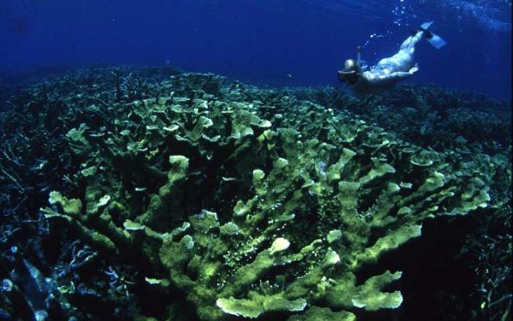
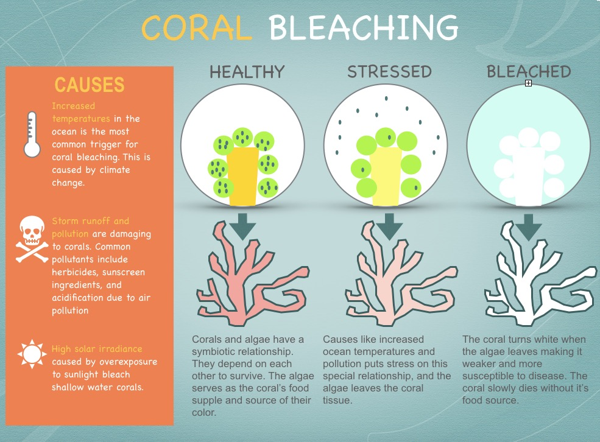

```{r setup, include=FALSE}
knitr::opts_chunk$set(echo = TRUE)
```



# Vocabulary

| Words from the text     | Synonym / explanation in English |
| ----------------------- | -------------------------------- |
| A snorkeler             | A man who is diving              |
| Upward                  | Rising / increasing              |
| To disentangle          | To reveal / to generate          |
| It is sickening         | It makes you sick                |
| Spike above a threshold | Exceed a certain value           |
| To get out of whack     | To degrade / to decline          |
| Starvation              | Famine / malnutrition            |
| A threshold             | A limit                          |
| To mitigate             | To attenuate                     |
| A statement             | A declaration                    |
| Thriving                | Prospering                       |

# Analysis table

|                              |                                                                                                                                                                                                                                                                                                                                                                                                                                                                                          |
| ---------------------------- | ---------------------------------------------------------------------------------------------------------------------------------------------------------------------------------------------------------------------------------------------------------------------------------------------------------------------------------------------------------------------------------------------------------------------------------------------------------------------------------------- |
| Researchers                  | Brain Lapointe, researcher at the Harbor Branch of Florida Atlantic University.  James Porter, an emeritus professor of ecology at the University of Georgia                                                                                                                                                                                                                                                                                                                             |
| Published in?                | July 17, 2019                                                                                                                                                                                                                                                                                                                                                                                                                                                                            |
| General topic?               | This study aims to understand coral dying. It is based on data collected from the Looe Key Sanctuary Preservation Area, in Florida.   It is the bleaching phenomenon which makes the coral die (illustration under the table).                                                                                                                                                                                                                                                                                          |
| Procedure/what was examined? | Researchers want to understand if, apart from global warning, they are other factors impacting this bleaching phenomenon. Because even if in the whole, temperatures increase, in the study area, local temperature didn’t change much.                                                                                                                                                                                                                                                  |
| Conclusions/discovery?       | First, bleaching events are due to peaks of temperature. When the temperature exceeds 30.5 degrees Celsius, corals expel its symbiotic algae. Second, the ratio of phosphorus and mostly the ratio of nitrogen in the water contributes to this phenomenon. Indeed, with agricultural fertilizers, phosphorus and nitrogen that are used on the land are found in the water after the rain’s events. When this natural equilibrium is disturbed, the membranes in the corals break down. Moreover, this perturbation generate an increase in the sensibility of corals at high light and high temperature.|
| Solutions?                   | This water loaded with nitrogen and phosphorus goes through non-efficient treatment plants. The population that lives near the coral reefs should improve their treatments plants like in Caribbean, where the treatments plants are able to pull nitrogen out of water.                                                                                                                                                                                                                 |



# Link


<https://www.livescience.com/65958-florida-coral-reefs-nitrogen.html>
