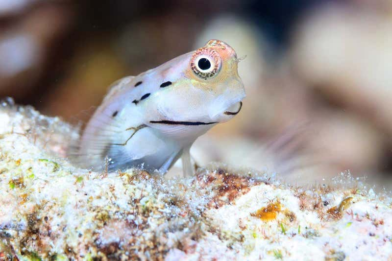
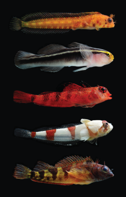

```{r setup, include=FALSE}
knitr::opts_chunk$set(echo = TRUE)
```



# Vocabulary

| Words from the text       | Synonym / explanation in English |
| ------------------------- | -------------------------------- |
| To overlook               | To turn a blind eye to           |
| Nooks and crannies        | Little places to hide            |
| Not be aware of something | To ignore something              |
| Cryptobenthic reef fish   | See the section "Illustration"   |
| Egg yolk                  | The yellow part of an egg        |
| To thrive                 | To prosper                       |

# Illustration

Cryptobenthic reef fish are less than 50 millimetres long as adults :


For more information about cryptobenthic reef fish, I suggest you to read this really interesting article : 
<https://pressfrom.info/us/news/science-and-technology/-280392-the-tiny-fish-that-break-a-fundamental-rule-of-vertebrate-life.html>

# Analysis table


# Link


<https://www.newscientist.com/article/2204346-the-tiniest-fish-are-the-most-important-for-healthy-coral-reefs/>
