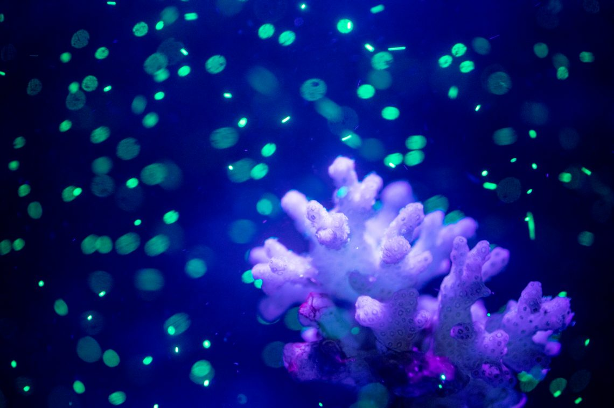

```{r setup, include=FALSE}
knitr::opts_chunk$set(echo = TRUE)
```



# Vocabulary

| Words from the text | Synonym / explanation in English |
| ------------------- | -------------------------------- |
| Harmful             | Unhealthy, damaging, injurious   |
| Ubiquitous          | Omnipresent, everywhere          |
| To root to the reef | To establish on the reef         |
| Counterpart         | Equivalent, equal                |
| Cues                | Signals, indications             |
| In the meantime     | Meanwhile, during this time      |

# Analysis table

|                              |                                                                                                                                                                                                                                                                                                                                                               |
| ---------------------------- | ------------------------------------------------------------------------------------------------------------------------------------------------------------------------------------------------------------------------------------------------------------------------------------------------------------------------------------------------------------- |
| Researchers                  | **Jeremy Axworthy**, a UW doctoral student in the School of Aquatic and Fishery Sciences. **Jacqueline Padilla-Gamiño**, assistant professor at the UW School of Aquatic and Fishery Sciences.                                                                                                                                                                |
| Published in?                | December 3, 2019                                                                                                                                                                                                                                                                                                                                              |
| General topic?               | This article is based on a study that aims to discover the impact of microplastics on the corals.                                                                                                                                                                                                                                                             |
| Procedure/what was examined? | Researchers want to observe the impact of microplastics on the coral’s health, especially when ocean temperature rise. They study four situations, the first, they feed corals with microplastics only. The second, they give microplastics and zooplankton. The third, with zooplankton only. And the last with nothing. And this, on two species of corals. |
| Conclusions/discovery?       | They could compare the four situations and could observe that corals with microplastics only eat nothing. However, if they are zooplankton with the microplastics, corals eat both. They also discovered that when temperature rise, corals eat less than if they were in good conditions.                                                                    |
| Remaining questions?         | We should think larger than just with corals and   microplastics. We just start to understand how our plastic waste circulates   in the nature. We have to hurry up, especially that the amount of plastic   released into the oceans will increase in the coming years.                                                                                      |

# Link


<https://www.washington.edu/news/2019/12/03/for-some-corals-meals-can-come-with-a-side-of-microplastics/>

# For the curious

## Link of the scientific study

<https://www.nature.com/articles/s41598-019-54698-7>

## Illustrations

<https://drive.google.com/drive/folders/1vsTGA4UaBD9UO0XyaRllxcaozapFzMzy>
