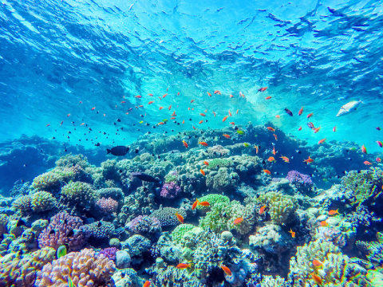

```{r setup, include=FALSE}
knitr::opts_chunk$set(echo = TRUE)
```




# Vocabulary

| Words from the text  | Synonym / explanation in English                                                                                                                                                                                                                                                                                                                                                                |
| -------------------- | ----------------------------------------------------------------------------------------------------------------------------------------------------------------------------------------------------------------------------------------------------------------------------------------------------------------------------------------------------------------------------------------------- |
| To gather            | To collect                                                                                                                                                                                                                                                                                                                                                                                      |
| Bacterial pests      | Devastating bacteria                                                                                                                                                                                                                                                                                                                                                                            |
| To can be home to …  | To shelter                                                                                                                                                                                                                                                                                                                                                                                      |
| A roster             | A list                                                                                                                                                                                                                                                                                                                                                                                          |
| To constrain         | To limit, to restrict                                                                                                                                                                                                                                                                                                                                                                           |
| To go haywire        | To take leave of, to go mad                                                                                                                                                                                                                                                                                                                                                                     |
| Insight              | Perspicacity, thought                                                                                                                                                                                                                                                                                                                                                                            |
| Keen                 | Enthusiastic                                                                                                                                                                                                                                                                                                                                                                                    |

# Analysis table

|                              |                                                                                                                                                                                                                                                                                                              |
| ---------------------------- | ------------------------------------------------------------------------------------------------------------------------------------------------------------------------------------------------------------------------------------------------------------------------------------------------------------ |
| Researchers                  | **Adrienne Correa**, a Rice University marine biologist. **Lauren Howe-Kerr**, a graduate student and study lead co-author. **Bénédicte Bachelot**.  Additional co-authors : **Carly Kenkel** of the University of Southern California and **Rachel Wright** of Smith College in Northampton, Massachusetts. |
| Published in?                | 12th February 2020                                                                                                                                                                                                                                                                                            |
| General topic?               | Researchers study corals that are tolerant of climate change.                                                                                                                                                                                                                                                |
| Procedure/what was examined? | They looked at the whole community of symbiotic algae, in particular dinoflagellates. They identify the different groups by DNA analysis. They tested tree types of seawater changes : the increasing temperature, the seawater acidification and a bacterial pathogens attack.                              |
| Conclusions/discovery?       | They noted that the most stress-resistant corals are the ones that have more similar group of symbiotic algae. But it is not the only factor that is important for the resistant, they are others.                                                                                                           |
| Remaining questions?         | Go further in the tests to find out precisely how   the symbiotic algae work together. The ultimate goal is to predict which coral will not   survive the next bleaching event by observing their symbiont community.                                                                                        |

# Link


<https://www.sciencedaily.com/releases/2020/02/200212150129.htm>

