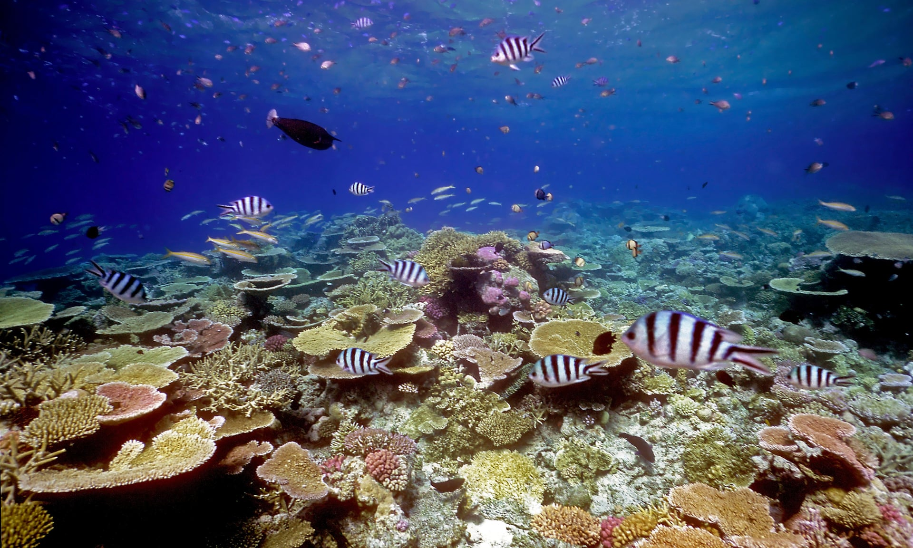

```{r setup, include=FALSE}
knitr::opts_chunk$set(echo = TRUE)
```



# Vocabulary

| Words from the text  | Synonym / explanation in English |
| -------------------- | -------------------------------- |
| To dwindle           | To decrease                      |
| To entice            | To attract / to seduce           |
| Claws                | Nails                            |
| Snapping shrimps     | Pistol shrimps                   |
| To hum               | To buzz                          |
| To whoop             | To cry out, to make noise        |
| A dummy speaker      | A speaker that does not work     |
| Seaweed              | Alga                             |
| To prey on           | To make it its prey              |
| To lure              | To attract by cunning            |
| To make aware        | To inform                        |
| Blast fishing        | Explosion fishing                |

# Analysis table

|                              |                                                                                                                                                                                                                                                                                                                                                                                                                                                                                                      |
| ---------------------------- | ---------------------------------------------------------------------------------------------------------------------------------------------------------------------------------------------------------------------------------------------------------------------------------------------------------------------------------------------------------------------------------------------------------------------------------------------------------------------------------------------------- |
| Researchers                  | Tim Gordon, first author of the latest study from the University of Exeter. Dr Catherine, Head of the Zoological Society of London and the University of Oxford, who was not involved in the study                                                                                                                                                                                                                                                                                                   |
| Published in?                | Fri 29 Nov 2019                                                                                                                                                                                                                                                                                                                                                                                                                                                                                      |
| General topic?               | The study of sounds which could attract back the wildlife on degraded reefs.                                                                                                                                                                                                                                                                                                                                                                                                                         |
| Procedure/what was examined? | 33 patches of dead coral rubble have been placed near a healthy reef. Researchers places speakers in 22 patches of which only 11 were working.                                                                                                                                                                                                                                                                                                                                                       |
| Conclusions/discovery?       | Healthy reefs make a lot of noises. These noises are recognizable by the fish and it is why, in the 11 patches with the artificial sounds, researchers observed more fish and a more diversity too with all levels of the food chain. This wildlife is beneficial for the reformation speed of the reef. But, use sound to reform the reef is not a solution of the basis problem. It a tool that we can put in our reef conservation toolbox but which has no action on the source of the problem.  |
| Remaining questions?         | Use sound is not the only thing to do. We should combine others techniques to boost the recolonization speed. Furthermore, we should keep in mind the importance of the source of the problem. Like global warming and blast fishing.                                                                                                                                                                                                                                                                |

# Link


<https://www.theguardian.com/environment/2019/nov/29/sonic-youth-healthy-reef-sounds-lure-young-fish-to-degraded-areas>

# For the curious

 fiund a video on the snapping shrimps :
 
 <https://www.youtube.com/watch?v=Zg10Et8FEWc>
